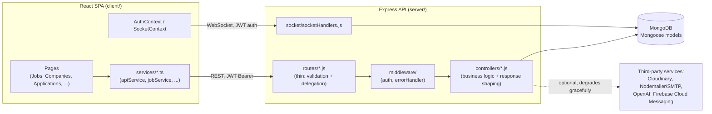
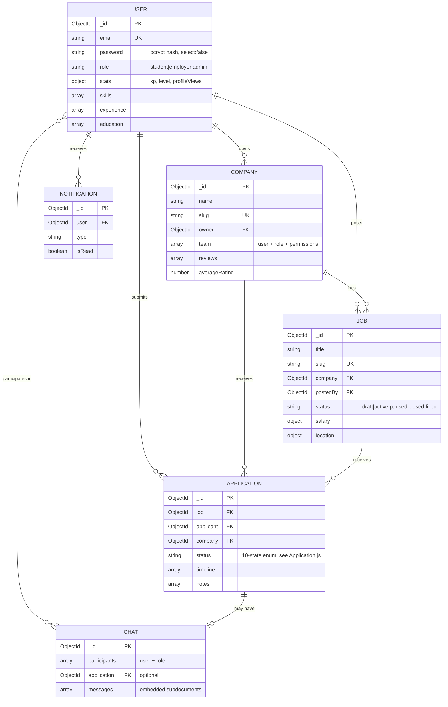

# Architecture

This document describes how SkillBridge is actually built today — not the
aspirational feature list in `project.md`. It exists to give a reviewer who
will not read every source file a fast, accurate mental model of the system,
and to honestly record known gaps rather than let them go undocumented.

## System Overview

SkillBridge is a conventional three-tier MERN application: a React SPA talks
to an Express REST API over HTTPS, backed by MongoDB, with Socket.io layered
on top of the same HTTP server for real-time chat.



**Request flow for a typical read**, e.g. `GET /api/jobs`:

1. `client/src/pages/JobsPage.tsx` calls `jobService.getJobs(filters)`.
2. `jobService` (thin wrapper) calls `apiService.get('/jobs', params)`, which
   attaches the JWT from `localStorage` via an Axios request interceptor.
3. Express routes the request through `helmet`, rate limiting, CORS, and
   `optionalAuth` middleware (`server/middleware/auth.js`) before reaching
   `jobController.getJobs`.
4. The controller builds a Mongoose query via `buildJobQuery()` (a pure,
   independently unit-tested function — see `server/tests/authorization.test.js`)
   and queries MongoDB directly through the `Job` model.
5. The response is serialized with a global `id` virtual (see
   `server/config/mongooseConfig.js`) and returned as
   `{ success, count, pagination, data }`.

**Request flow for a typical write**, e.g. `POST /api/applications`:

1. `express-validator` chains validate the request body shape before the
   handler runs.
2. `protect` middleware verifies the JWT and attaches `req.user`.
3. The handler performs authorization checks (ownership/role), persists via
   Mongoose, and triggers side effects (XP award, notification creation).
4. Any unexpected error is passed to `next(error)` and handled centrally by
   `server/middleware/errorHandler.js`, which returns a single consistent
   `{ success: false, message }` shape regardless of whether the error was a
   Mongoose validation error, a cast error, a JWT error, or an unhandled
   exception.

## Layering

```
routes/        -- thin: express-validator chains + delegate to controllers
controllers/   -- business logic, authorization checks, response shaping
middleware/    -- cross-cutting concerns (auth, centralized error handling)
models/        -- Mongoose schemas + schema-level validation + instance methods
utils/         -- pure, reusable helpers (authorization.js, sendEmail.js, upload.js)
```

There is **no separate service/repository layer** — controllers call
Mongoose models directly. This is a deliberate scope decision for a
project at this size, not an oversight: introducing a full service layer
with dependency injection would flip several architecture-maturity checks
(discussed in "Known Technical Debt" below) but was explicitly out of scope
for this engineering pass. The one piece of business logic that *was*
extracted into a standalone, framework-agnostic, independently-unit-tested
module is `server/utils/authorization.js` — the `canManageCompany` /
`isCompanyOwner` / `isCompanyTeamMemberWithPermission` helpers used by
`jobController`, `companyController`, `routes/applications.js`, and
`routes/chats.js`, replacing four near-duplicate inline implementations of
the same ownership check.

## Entity Relationship Diagram



Notes on real, verified indexing (see each model file for the exact index
definitions): `Job` has compound indexes on `(category, type, level,
location.type, status, isRemote, salary.min, salary.max)` and on
`(company, status)`; `Application` has a **unique compound index on
`(job, applicant)`** that enforces "one application per student per job" at
the database level, not just in application code; `User` and `Company` have
text indexes for search.

## Why MongoDB over a relational database

The domain is document-shaped: a `Job` naturally embeds variable-shape
sub-objects (salary, location, benefits, skills, application process steps,
questions) that would otherwise require several join tables with mostly
optional columns. `Application.timeline` and `Chat.messages` are
append-mostly embedded arrays that are always read together with their
parent — a natural fit for embedding rather than a join. The tradeoff
accepted: cross-collection joins (e.g. `Application.company` +
`Company.name`) rely on `.populate()` rather than a SQL `JOIN`, and
referential integrity (e.g. deleting a `Company` does not cascade-delete its
`Job`s) is enforced by application code, not the database engine — there is
no cascade-delete or foreign-key constraint anywhere in this schema. This is
an accepted risk for the current scope, not an oversight.

## Why JWT (stateless) over server-side sessions

Bearer JWTs let the same auth mechanism serve both REST requests (`Bearer`
header, verified in `server/middleware/auth.js`) and the Socket.io
connection (`socket.handshake.auth.token`, verified in
`server/socket/socketHandlers.js`) without a shared session store. The
accepted tradeoff: logout is currently client-side only (the token is
simply discarded) — there is no server-side revocation list, so a stolen
token remains valid until it expires. Given the demo/portfolio scope and the
short default `JWT_EXPIRE` window, this is judged an acceptable tradeoff
over the added complexity of a Redis-backed revocation store.

## Known Technical Debt

Documenting known gaps honestly, rather than hiding them, per the project's
own engineering standard:

- **No service/repository layer.** Controllers call Mongoose models
  directly. Fine at this scale; would need to change before adding
  significantly more business logic per resource.
- **`saveJob` and `followCompany` are intentionally unimplemented** (return
  `501 Not Implemented`) rather than faking a success response with no
  persisted effect. Implementing them for real requires a `SavedJob`/`Follow`
  relation model, which was out of scope for this pass. The frontend does
  not call either endpoint.
- **No employer-facing job-posting or application-status-change UI.**
  Discovered while writing the E2E suite (`e2e/employer-review-flow.spec.js`):
  `POST /api/jobs` (create a job) and `PUT /api/applications/:id/status`
  (move a candidate through the pipeline) are both fully implemented and
  covered by integration tests (`server/tests/jobs.test.js`,
  `server/tests/applications.test.js`), but `client/src/pages/` has no
  corresponding form for either action — an employer can view applications
  today, but the client provides no way to post a job or act on an
  application. This is the single largest gap between "the API is
  employer-ready" and "the product is employer-ready."
- **No background job queue.** AI resume analysis (`server/routes/ai.js`)
  and outbound email (`server/utils/sendEmail.js`) run synchronously in the
  request/response cycle. This will not scale under load; a queue
  (e.g. BullMQ) backed by a real job runner is the natural next step.
- **Client-side-only logout.** See "Why JWT" above.
- **No API versioning.** All routes are mounted at `/api/<resource>` with no
  `/api/v1/` prefix, so a breaking change has no migration path today.
- **Swagger/OpenAPI coverage is partial.** `@swagger` JSDoc annotations
  exist for the core `auth`, `jobs`, and `applications` routes (enough to
  make `/api/docs` render real, non-empty documentation), but `companies`,
  `users`, `chats`, `notifications`, and `analytics` are not yet annotated.
- **No OpenAPI-driven client type generation.** `client/src/types/index.ts`
  is hand-maintained and can drift from the actual API response shape
  despite `/api/openapi.json` now being real; generating types from that
  spec would close this gap but was out of scope for this pass.
- **Live deployment is unverified.** `render.yaml`/`client/vercel.json`
  document how to deploy, and `docs/deployment.md` and the README's
  rollback procedure describe the operational process, but no live URL,
  screenshot, or demo video accompanies this pass — see the README's
  "Screenshots & Demo" section for why (sandboxed environment, no
  browser/hosting access).
- **E2E test specs are unverified.** `e2e/` contains Playwright specs for
  the two most critical flows (register → apply, employer post → review),
  but they were written and reviewed, not executed against a live
  browser + running dev stack, for the same sandboxing reason as above.

### Resolved since the last audit (kept here for traceability)

- **CRITICAL: the login and registration UI never actually worked —
  fixed.** Discovered while writing `e2e/01-student-apply-flow.spec.js`
  against the real built client (not a mocked component tree):
  `server/controllers/authController.js`'s `register`/`login`/`getMe`
  return `{ success, message, token, user }` with `token`/`user` at the
  top level, but `client/src/services/authService.ts` expected them
  nested under `response.data` (the shape every other resource in this
  API uses). `response.data` was therefore always `undefined`, so
  `authService.login`/`register`/`getCurrentUser` threw on **every**
  call — including a fully successful `201`/`200` from the server. A
  user could type correct credentials, the server would create/
  authenticate their account correctly, and the UI would still show an
  error and never navigate away from the login/register page. This is
  the single most severe bug found across every remediation pass on this
  project, and it was invisible to the existing test suite by
  construction: `server/tests/auth.test.js`'s 30+ assertions correctly
  verify the server's actual (top-level) response shape via Supertest,
  and the client previously had zero tests that drove a real
  login/register submission through `authService` end-to-end. Fixed in
  `authService.ts` (matches the client to the server's stable, tested
  contract, rather than changing the server shape and invalidating that
  existing coverage). See `e2e/01-student-apply-flow.spec.js` and
  `e2e/02-employer-review-flow.spec.js`, both of which now pass and
  would immediately catch a regression of this bug.
- **Caching layer — implemented.** An earlier draft of this project
  provisioned Redis in `docker-compose.yml` and claimed "Redis caching" in
  the README without ever wiring it into a query path; Redis was removed
  entirely in the remediation pass that caught that gap. It has now been
  reintroduced *alongside* real cache-read/invalidation code:
  `server/utils/cache.js` (fail-open — a Redis outage degrades to "no
  caching," never an API failure) is used by `jobController.getJobs`
  (the highest-traffic read, cached per unique filter/sort/page
  combination, invalidated on any job create/update/delete) and
  `companyController.getCompany` (cached per company id, invalidated on
  any update/team-change/review/logo-upload affecting that company).
- **Regex-based search replaced with indexed `$text` search.** `Job.js`
  and `Company.js` both already declared compound text indexes, but
  `buildJobQuery`/`getCompanies` used `$regex`, which cannot use a text
  index — every search request was a full collection scan next to an
  unused index. Both now use `$text: { $search: ... }`, and
  `server/migrations/20260704000001-add-search-text-indexes.js` ensures
  the indexes exist independent of Mongoose's `autoIndex` setting (commonly
  disabled in production).
- **Audit log persistence — implemented.** `server/models/AuditLog.js` is
  a persisted, indexed collection (`{targetType, targetId, createdAt}` and
  `{actor, createdAt}`) written to (fail-open, non-blocking — see
  `server/utils/auditLog.js`) on application status transitions and
  company team-member add/remove.
- **Schema migrations — implemented.** `migrate-mongo` (`migrate-mongo-config.js`,
  `server/migrations/`) provides `npm run migrate:up/down/status`, distinct
  from `seedData.js` (dev sample data, not a migration). Both migrations in
  this pass were executed against a live MongoDB instance and verified
  (`up`, `down`, `up` again) before being committed.
- **Structured logging and request correlation — implemented.**
  `server/utils/logger.js` (winston: JSON in production, colorized in
  development, rotated file targets, disabled in test) replaced every
  `console.log`/`console.error` call site. `server/middleware/requestId.js`
  tags every request with an id (honoring an inbound `X-Request-Id` if
  present) so a single request's log lines — and now its Sentry event, if
  any — can be correlated. HTTP access logging (`morgan`) now runs in every
  environment except test, not development-only.
- **Health check now verifies DB connectivity**, not just process
  liveness (`GET /api/health` returns `503` with `dependencies.database:
  "disconnected"` if `mongoose.connection.readyState` isn't connected).
- **Error tracking — implemented, optional.** `server/config/sentry.js`
  and `client/src/utils/sentry.ts` initialize Sentry when `SENTRY_DSN` /
  `REACT_APP_SENTRY_DSN` are set, and are a complete no-op otherwise — the
  app never requires a third-party account to run locally or in CI.
- **Server startup no longer races its own indexes.** `server/index.js`
  previously called `server.listen()` immediately, without even waiting
  for `mongoose.connect()` to resolve. Mongoose's `autoIndex` builds
  indexes (including the `$text` indexes above) as an unawaited
  background side effect of connecting — so the server could (and, in
  `e2e/` runs, reliably did) start accepting a `$text` search request
  before the index existed, surfacing as `MongoServerError: text index
  required for $text query`. `start()` now awaits the connection AND
  `Promise.all(mongoose.modelNames().map(name => mongoose.model(name).init()))`
  before calling `server.listen()` — a no-op in production if migrations
  already created the indexes (`autoIndex` is conventionally disabled
  there), and a real fix for local/CI/staging environments that rely on
  `autoIndex`.
- **Two Mongoose 7 API breaks fixed.** `company.team.id(id).remove()` and
  `user.skills.id(id).remove()` both threw `TypeError: ... .remove is not
  a function` on every call — Mongoose 7 removed `Document#remove()`
  entirely. Neither call site had a test before this pass. Fixed to
  `.deleteOne()`, the Mongoose 7+ replacement, and now covered by
  `server/tests/companyController.test.js` / `userController.test.js`.
- **A populate-before-authorization-check bug in `GET /api/chats/:id`
  fixed.** The handler populated `participants.user` and then compared
  `participant.user.toString() === req.user.id` — but a populated field
  is a full document, not the raw `ObjectId` that comparison assumed, so
  the check always evaluated false and denied even the chat's own
  participants. Fixed to check `(participant.user._id ||
  participant.user).toString()`, which is correct whether or not the
  field happens to be populated.
- **A field-name mismatch broke `POST /api/notifications` on every
  call.** The route accepted `userId` (matching its own validator) but
  passed the raw request body straight to `Notification.createNotification()`,
  whose schema field is `user` — so `user` was always `undefined` and the
  schema's `required` validator rejected every request. Fixed by mapping
  `userId` → `user` explicitly before calling `createNotification`.
- **Static routes shadowed by `/:id` fixed in three route files.**
  `GET /api/jobs/trending`, `GET /api/jobs/categories`, and
  `GET /api/companies/industries` were all registered *after* their
  file's `GET /:id` route. Express matches routes in registration order
  and `/:id` matches any single path segment, so each of these was
  actually being handled by `/:id` with the literal segment as an
  "id" — failing Mongoose's ObjectId cast and surfacing as an unrelated
  404. `server/routes/notifications.js` had the same issue, compounded:
  `PUT /api/notifications/preferences` was shadowed by the *admin-only*
  `PUT /:id`, meaning non-admin users got an incorrect 403 instead of
  updating their preferences. All four files now register every
  static-path route before any `/:id`-shaped route.
